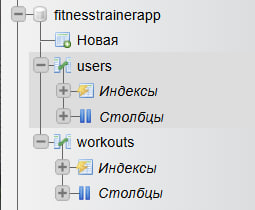

# Fitness Trainer App

## Опис функціоналу програми
Додаток "Fitness Trainer" призначений для планування та контролю фітнес-занять. Програма має два основні вікна:  
- **LoginWindow** – вікно для входу та реєстрації користувачів, інформація про яких зберігається в базі даних MySQL (phpMyAdmin).  
- **WorkoutWindow** – вікно для створення, редагування та видалення нотаток про заняття. Користувач може вибрати день тижня, час та тип тренування (наприклад, присідання, жим лежачи).

При успішному вході відкривається вікно планування тренувань із зручним інтерфейсом.

---

## Процес запуску локально
1. Встановити MySQL сервер і phpMyAdmin (або скористатися хостингом з MySQL).  
2. Створити базу даних `fitness_trainer` та таблиці `users` і `workouts` згідно зі схемою у коді (схема надається окремо або створюється автоматично).  
3. Відкрити проект у Visual Studio.  
4. Встановити NuGet пакети:  
   - MySql.Data (для підключення до MySQL)  
5. Налаштувати підключення до бази у файлі конфігурації або у коді (рядок підключення).  
6. Запустити проект. Спочатку відкриється вікно входу, де можна зареєструватися або увійти.  
7. Після входу відобразиться вікно для роботи з тренуваннями.

---

## Programming Principles
У проекті були дотримані наступні принципи програмування:  
1. **DRY (Don't Repeat Yourself)** – уникав дублювання коду, наприклад, методи підключення до бази винесені в окремий клас.  
2. **Single Responsibility Principle (SRP)** – кожен клас виконує одну відповідальність (LoginWindow – відповідальний за вхід, WorkoutWindow – за заняття).  
3. **Encapsulation** – поля та логіка приховані, доступ здійснюється через властивості і методи.  
4. **Open/Closed Principle (OCP)** – додавання нових типів тренувань або змін у логіку можливе без модифікації існуючого коду.  
5. **Separation of Concerns** – UI, бізнес-логіка та доступ до даних розділені.

---

# Fitness Trainer App

## Programming Principles

1. **DRY (Don't Repeat Yourself)**  
   Виніс логіку підключення до бази у клас `Database.cs` ([Database.cs, рядок 10](https://github.com/Oleg4539/Lab_6-_Project/blob/46f3448886e5f5ef540c3f17a756df07e4ab4a5c/Lab_6/FitnessTrainerApp/Data/Database.cs#L9)).

2. **Single Responsibility Principle (SRP)**  
   `LoginWindow.xaml.cs` відповідає лише за вхід користувача ([LoginWindow.xaml.cs, рядок 9](https://github.com/Oleg4539/Lab_6-_Project/blob/46f3448886e5f5ef540c3f17a756df07e4ab4a5c/Lab_6/FitnessTrainerApp/Views/LoginWindow.xaml.cs#L9)).  
   `WorkoutWindow.xaml.cs` — за планування занять ([WorkoutWindow.xaml.cs, рядок 10](https://github.com/Oleg4539/Lab_6-_Project/blob/46f3448886e5f5ef540c3f17a756df07e4ab4a5c/Lab_6/FitnessTrainerApp/Views/WorkoutWindow.xaml.cs#L10)).

3. **Encapsulation**  
   Використання приватних полів і властивостей у класах моделей, наприклад у `User.cs` ([User.cs, рядок 3](https://github.com/Oleg4539/Lab_6-_Project/blob/46f3448886e5f5ef540c3f17a756df07e4ab4a5c/Lab_6/FitnessTrainerApp/Models/User.cs#L3)).

4. **Open/Closed Principle (OCP)**  
   Можливість додати нові типи тренувань без зміни існуючого коду у `WorkoutType.cs`.

5. **Separation of Concerns**  
   Відокремлення UI та логіки у MVVM структурі: ViewModel знаходиться у `WorkoutViewModel.cs`.

6. **Моя невеличка БД** 

7. **Design Patterns** 
1. Застосовується базова логіка MVVM (прямі обробники у code-behind)
2. Repository Pattern - окреми' клас під БД ([Database.cs, рядок 9](https://github.com/Oleg4539/Lab_6-_Project/blob/46f3448886e5f5ef540c3f17a756df07e4ab4a5c/Lab_6/FitnessTrainerApp/Data/Database.cs#L9))
3. Мій проект дуже простий та невеличкий, тож нажаль я більше не можу виділити окремі "Design Patterns"😞

8. **Refactoring Techniques** 
1. Extract Method
Суть: винесення частин коду в окремі методи для підвищення читабельності.
([WorkoutWindow.xaml.cs, рядок 55](https://github.com/Oleg4539/Lab_6-_Project/blob/46f3448886e5f5ef540c3f17a756df07e4ab4a5c/Lab_6/FitnessTrainerApp/Views/WorkoutWindow.xaml.cs#L55))
([WorkoutWindow.xaml.cs, рядок 75](https://github.com/Oleg4539/Lab_6-_Project/blob/46f3448886e5f5ef540c3f17a756df07e4ab4a5c/Lab_6/FitnessTrainerApp/Views/WorkoutWindow.xaml.cs#L75))
([WorkoutWindow.xaml.cs, рядок 91](https://github.com/Oleg4539/Lab_6-_Project/blob/46f3448886e5f5ef540c3f17a756df07e4ab4a5c/Lab_6/FitnessTrainerApp/Views/WorkoutWindow.xaml.cs#L91))
2. Extract Class
Суть: перенесення відповідальностей з одного класу в інший.
Приклад: я виніс логіку з'єднання з БД в окремий клас Database
3. Replace Magic Strings/Numbers with Constants
Суть: уникання "магічних" рядків/чисел у коді.
Приклад: я використовую connectionString як константу у тому самому Database
4. Encapsulate Field / Data
Суть: інкапсуляція доступу до полів або використання властивостей.
Приклад: у своєму XAML я вже використовую іменовані поля (наприклад DayComboBox, UsernameBox), до яких звертаюсь через інкапсуляцію.
5. Rename for Clarity
Суть: перейменування змінних/методів/класів для кращого розуміння.
Приклад: назви RegisterWindow, WorkoutWindow, Database — усі описові і зрозумілі.